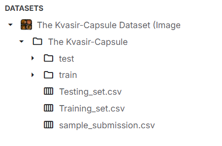
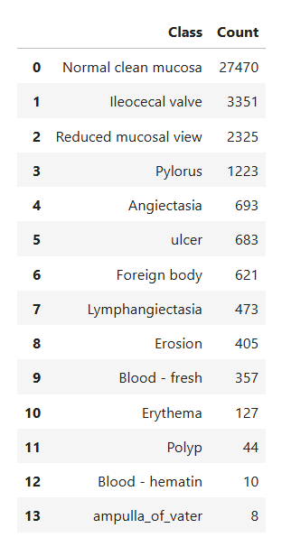
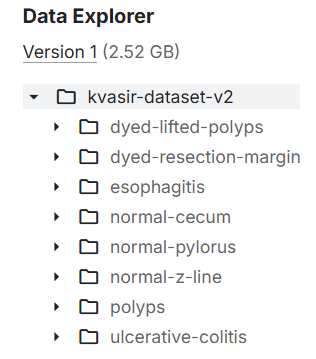
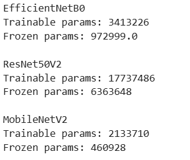
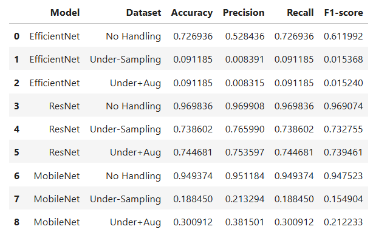
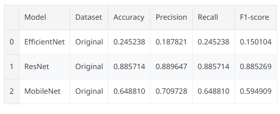
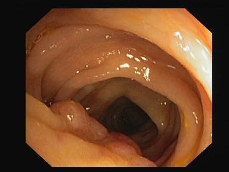
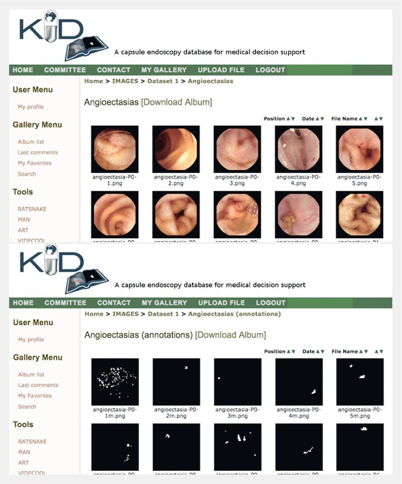

# 🧠 Deep Learning Minor Project
> Gastrointestinal Image Classification using CNN Transfer Learning

**Contributors:**
- S. Nrupendra — U23AI055
- Vidwath Kumar — U23AI067

---

## 📁 Datasets

### Dataset 1 — Kvasir-Capsule

**Path:** `/kaggle/input/datasets/adityayellamilli/the-kvasir-capsule-dataset-images`

The official repository for the Kvasir-Capsule dataset — the largest publicly released PillCAM dataset. In total, the dataset contains **47,238 labeled images** and **117 videos**, capturing anatomical landmarks and pathological and normal findings.

> For this experiment we have considered only images.





| Split | Images |
|-------|--------|
| Train | 37,790 |
| Test  | 9,448  |

---

#### ⚠️ Class Imbalance

This dataset is highly imbalanced. It was preprocessed into three experimental conditions:

1. **No Handling** — raw class distribution used as-is
2. **Under-Sampling** — majority classes reduced to 200 samples each
3. **Under-Sampling + Augmentation** — undersampling applied, then augmentation on minority classes:
   - Flipping
   - Zooming
   - Rotating

#### 🔀 Data Split

| Training | Validation | Testing |
|----------|------------|---------|
| 70%      | 15%        | 15%     |

---

### Dataset 2 — Kvasir-v2

**Path:** `/kaggle/input/datasets/yasserhessein/the-kvasir-dataset`

The `kvasir-dataset-v2` archive contains **8,000 images** across **8 classes** (1,000 images each). Images are JPEG-encoded and stored in class-named folders.

> Since this is a perfectly balanced dataset, the same models were applied directly without any imbalance preprocessing.



**Classes:**
`dyed-lifted-polyps` · `dyed-resection-margins` · `esophagitis` · `normal-cecum` · `normal-pylorus` · `normal-z-line` · `polyps` · `ulcerative-colitis`

---

## 🤖 Models

Three CNN architectures were used. All backbones were initialized with **ImageNet pretrained weights** and **70% of layers were frozen** during training.



| Model | Key Idea | Characteristic |
|-------|----------|----------------|
| **EfficientNetB0** | Compound scaling of width, depth & resolution | Best accuracy-efficiency trade-off |
| **ResNet50** | Residual (skip) connections | Enables very deep networks without vanishing gradients |
| **MobileNet** | Depthwise separable convolutions | Lightweight — minimal parameters, fast inference |

---

## ⚙️ Training Strategy

### 1. ReduceLROnPlateau

Reduces the learning rate when validation loss stops improving, helping the model fine-tune more precisely.
```python
lr_scheduler = ReduceLROnPlateau(
    monitor='val_loss',
    factor=0.5,      # LR becomes half
    patience=1,      # wait 1 epoch
    min_lr=1e-6,     # don't go below this
    verbose=1
)
```

### 2. EarlyStopping

Stops training if the model stops improving and restores the best weights seen during training.
```python
early_stop = EarlyStopping(
    monitor='val_loss',
    patience=2,                  # wait 2 epochs
    restore_best_weights=True,   # go back to best model
    verbose=1
)
```

### 3. LR Tracking

A custom **Learning Rate Logger** callback was used to track LR changes across epochs.

---

### 📉 Loss Types

| Loss | Computed On | Meaning |
|------|-------------|---------|
| **Train Loss** | Training data | How well the model fits the data it has seen; updated every batch/epoch |
| **Validation Loss** | Unseen val data | How well the model generalizes during training |
| **Test Loss** | Completely unseen data | Final real-world performance estimate |

---

## 📊 Results

### Dataset 1 — Kvasir-Capsule



### Dataset 2 — Kvasir-v2



---

## 🔍 Key Observations

### Why "No Handling" Shows High Accuracy

> **Accuracy Paradox:** If 90% of data belongs to class A, a model that always predicts class A achieves 90% accuracy — without learning anything useful. Precision and Recall for minority classes remain near zero.

### Model Analysis

**ResNet50 — Consistently Strongest**
- Performs well across all dataset conditions
- Robust to class imbalance
- Deep residual connections generalize well to medical image textures

**EfficientNetB0 — Failed with Under-Sampling**
- Needs more data to leverage compound scaling effectively
- Sensitive to reduced dataset sizes

**MobileNet — Struggled with Reduced Data**
- Lightweight architecture means lower learning capacity
- Depthwise separable convolutions need sufficient data diversity

### ⚠️ Critical: Preprocessing Mismatch

All three models require their **own model-specific preprocessing function**, not a generic `rescale=1./255`. This mismatch was the root cause of EfficientNet's poor performance.

| Model | Expected Input | Got (`rescale=1./255`) | Sensitivity | Result |
|-------|---------------|------------------------|-------------|--------|
| EfficientNetB0 | Internal normalization | `[0, 1]` | Very High | 24.5% |
| MobileNet | `[-1, 1]` | `[0, 1]` | Medium | 64.9% |
| ResNet50 | `[0, 255]` → mean subtracted | `[0, 1]` | Low | 88.6% |

# Use preprocessing_function= instead of rescale=
train_datagen = ImageDataGenerator(preprocessing_function=eff_pre)
```

After this fix, EfficientNet is expected to reach **85–92%** accuracy.

---

## 🔭 Other Datasets for Future Work

### CVC-ClinicDB

> [Kaggle Link](https://www.kaggle.com/datasets/balraj98/cvcclinicdb)

A database of colonoscopy video frames with pixel-level polyp masks. Each frame has a paired binary ground-truth mask marking exact polyp boundaries.

| Property | Value |
|----------|-------|
| Images | 612 |
| Sequences | 31 |
| Resolution | 384 × 288 |
| Task | Semantic Segmentation |

**Sample:**

Original:



Ground Truth:


---

### ETIS-LaribPolypDB

> [Kaggle Link](https://www.kaggle.com/datasets/nguyenvoquocduong/etis-laribpolypdb?select=images)

Polyp detection dataset with challenging colonoscopy cases. Commonly benchmarked alongside CVC-ClinicDB.

---

### KID Dataset

> [Source](https://pmc.ncbi.nlm.nih.gov/articles/PMC5452962/)

Capsule endoscopy dataset for small bowel lesion detection. Contains video and still-image data with clinical annotations.

