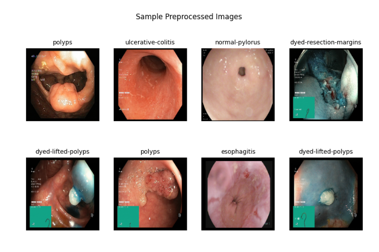

# Report on Deep Learning Minor Project
        - Contributors: S.Nrupendra (U23AI055), Vidwath Kumar(U23AI067)

For this project we have ran experiments on the datasest:
1) `/kaggle/input/datasets/adityayellamilli/the-kvasircapsule-dataset-images`
2) `Dataset Path: /kaggle/input/datasets/yasserhessein/the-kvasir-dataset`

## Dataset 1:
This is the official repository for the Kvasir-Capsule dataset, which is the largest publicly released PillCAM dataset. In total, the dataset contains 47,238 labeled images and 117 videos, where it captures anatomical landmarks and pathological and normal findings.

For this experiment we have considered only images

The above image shows the structure of the Dataset

Train folder has 37,790 images and Test has 9,448 images and the `.csv` files have their respective labeled class

A more clear intution of the dataset

This dataset is highly imbalanced and we have preprocessed this dataset into:
    1) Undersampling : Decreasing the majority classes to 200 labels each class
    2) Undersampling + Augmentation : Decreasing the majority classes and applying Augmentation to minority classes like:
        * Fliping the image
        * Zooming
        * Rotating

Data split for Train :
    * 70% -> Training
    * 15% -> Validation
    * 15% -> Testing

The CNN models used in this experiment are :
    1) EfficientNetB0
        * Efficient takes width,channels and resolution into consideration
    2) ResNet50
        * ResNet is famous for deeper Neural Networks
    3) MobileNet
        * MobileNet uses linear seperable convolution layers and takes very less parameters compared, so it's a light weight model
We have freezed 70% of the layers in all the models

Number of Parameters which are updated while training

### Intelligent Learning Rate Control
### 1) ReduceLRonPlateau
<code>
lr_scheduler = ReduceLROnPlateau(
    monitor='val_loss',
    factor=0.5,
    patience=1,
    min_lr=1e-6,
    verbose=1
)
</code>

If Validation loss does not improve it reduces learning rate

Key params:
* factor=0.5 -> LR becomes half
* patience=1 -> wait 1 epoch
* min_lr=1e-6 -> don’t go below this
👉 Helps model fine-tune better

### 2) EarlyStopping
<code>
early_stop = EarlyStopping(
    monitor='val_loss',
    patience=2,
    restore_best_weights=True,
    verbose=1
)
</code>

Stops traning if model stops improving

Key params:
* patience=2 -> wait 2 epochs
* restore_best_weights=True -> go back to best model
👉 Prevents overfitting + wasted time

### 3) LR Tracking
Created a Custom Learning Rate Logger to track learning rate

### Losses
1) Train Loss
* Loss computed on training data
* Updated every batch/epoch during training
Meaning:
* How well the model is fitting the data it has seen

2) Validation Loss
* Loss computed on validation data (unseen during training)
Meaning:
* How well the model generalizes during training

3) Test Loss
* Loss computed on test data (completely unseen)
Meaning:
* Final real-world performance estimate

### Result:

The experimental results demonstrate that models trained without handling class imbalance tend to favor majority classes, resulting in poor recall for minority classes. Under-sampling improves balance but sacrifices data, which can limit performance. The combination of under-sampling and augmentation provides the best overall results by maintaining class balance while preserving data diversity.

Among the models, ResNet achieved the best result followed MobileNet.

1. ResNet is consistently strongest
    * Performs well across all settings
    * Robust to data imbalance
2. EfficientNet failed badly with under-sampling
    * Possible reasons are Needs more data
    * Sensitive to dataset size
3. MobileNet struggles with reduced data
   * Lightweight means less learning capacity
  
### Why "No Handling" shows high accuracy?

Because:
* Model predicts majority class most of the time

Example:
* If 90% data = class A
* Model predicts always A which gives 90% accuracy

But:
* Precision/Recall for minority class = bad

## Dataset 2:
The kvasir-dataset-v2.zip (size 2.3 GB) archive contains 8,000 images, 8 classes, 1,000 images for each class. The images are stored in the separate folders named accordingly to the name of the class images belongs to. The image files are encoded using JPEG compression. The encoding settings can vary across the dataset and they reflecting the a priori unknown endoscopic equipment settings. The extension of the image files is ".jpg"

Since this is a balanced dataset we have experimented the same models used above directly without any datapreprocessing

### Result

## Other Datasets:
Other datasets which can be used for future enhancement are :

1) CVC-ClinicDB (https://www.kaggle.com/datasets/balraj98/cvcclinicdb) :
CVC-ClinicDB is a database of frames extracted from colonoscopy videos. The dataset contains several examples of polyp frames & corresponding ground truth for them. The Ground Truth images consists of a mask corresponding to the region covered by the polyp in the image.

CVC-ClinicDB database consists of two different types of images:

Original images: original/frame_number.tiff
Polyp mask: ground truth/frame_number.tiff

### Sample Image:
Original :

Ground Truth :

2) ETIS-LaribPolypDB :
https://www.kaggle.com/datasets/nguyenvoquocduong/etis-laribpolypdb?select=images

3) KID Dataset :
https://pmc.ncbi.nlm.nih.gov/articles/PMC5452962/
